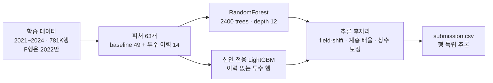

# 투구 제구 등급 예측 — LG Aimers 9기 오프라인 해커톤

KBO 투구가 어느 제구 등급(`Shadow` / `Heart` / `Failure`)에 속할지 확률을 예측합니다. 입력은 **투구 직전에 알 수 있는 사전 정보 29열**뿐이고, 좌표·구종·구속 같은 사후 정보는 평가 데이터에 없습니다. 2019~2024 시즌으로 학습해 2025 시즌을 예측합니다.

`Python 3.11` · `scikit-learn` · `LightGBM` · `pandas` · `NumPy`  
[DACON 236767](https://dacon.io/competitions/official/236767) · 2026.09

## 성능

| 구분 | 총점 | Pitch (행 Brier, 70%) | Player (투수 Kendall τ-b, 30%) |
| --- | --- | --- | --- |
| **최종 제출** | **70.6899** | 70.0256 | **72.2402** |
| 운영진 baseline RF | 68.5265 | 70.2115 | 64.5949 |
| 대회 마지막 날 직전 1위 | 70.2124 | — | — |

```
총점 = 0.7 × Pitch + 0.3 × Player
Pitch  = 100 × (1 − Brier/2)   # 행 단위 다중 클래스 Brier
Player = 50 × (1 + τb)         # 투수별 예측 평균 점수의 순위 일치도 (평가 50구 이상)
```

Pitch 는 등급 분포를 상수로 내기만 해도 69.29 가 나오는 포화 구간입니다. 실질 경쟁은 Player 한 항목이고, baseline 대비 개선분(+2.16)도 거의 전부 여기서 나왔습니다(64.59 → 72.24). 설계 전반이 **투수 단위 순위**를 겨냥하고 있습니다.

## 파이프라인



학습(약 4분)과 후처리는 분리돼 있습니다. 후처리 상수는 `patch_post.py` 로 학습된 번들에 주입하므로 **재학습 없이** 바꿀 수 있습니다.

## 1. 학습 데이터 선택

2021~2024 시즌 **781,141행**. 투수 이력 계산에는 2019년부터 전 구간을 사용합니다.

퓨처스리그(`game_type = F`) 행은 2022 시즌만 학습에 넣습니다. 
같은 투수의 F 경기와 1군(R) 경기 점수 차이가 2019~2022년에는 +4~+9.4점이었다가 2023~2024년에는 ≈0으로 사라집니다. 
운영진이 공개한 좌표 정의로 학습 라벨 122만 행을 재구성해 원인을 확인했습니다 — 반대투구(`REVERSE_YN`) 비율이 F 에서 5~16% → 29~30% 로 뛴 반면 좌표 기반 구역 점수는 6시즌 내내 35~36 으로 불변이었습니다. 
선수 구성이 아니라 리그 판정 규칙의 변화입니다.

2025 평가 데이터는 2022년 이전 체제 쪽이므로, F 행을 전부 넣으면 모델이 2023~24 체제를 학습해 2025에서 무너집니다. 그래서 프리미엄이 가장 큰 2022 시즌 F 행만 사용합니다.

## 2. 피처

**63개** = 운영진 baseline 49개 + 확장 투수 이력 14개. `pitcher_id` / `batter_id` 는 OrdinalEncoder 범주형으로 유지합니다.

평가 데이터에는 투구 직전 정보만 있습니다. 좌표 · 구종 · 구속은 던지고 나야 아는 값이라 2025년 평가 행에는 없지만 학습 데이터에는 있습니다. 이 비대칭 때문에 **사후 정보는 "학습 때 계산해 표로 고정 → 추론 때 투수 ID 로 조회"** 경로로만 모델에 들어갈 수 있습니다. 투수 이력이 피처 설계의 중심인 이유입니다(`src/features.py: make_history`).

- **시간 창 3개** — 장기(전체) · 중기(decay 0.5) · 직전 시즌 등급 점수. 한 숫자로 요약하면 정보가 뭉개지므로 셋을 따로 주고 가중은 모델이 학습하게 했습니다. 결과적으로 장기 평균이 우세했고, 최근 시즌을 강조하는 설정(decay 0.7)은 더 나빴습니다
- **신뢰도 피처** — 유효 표본 수, 마지막 기록 시즌까지의 거리. "이 이력을 얼마나 믿을지"를 함께 줍니다
- **사전 수축 α = 400** — 표본이 적은 투수의 비율 추정을 리그 평균 쪽으로 강하게 당깁니다

### 누수 차단

2024년 행의 이력에 2024년 기록이 들어가면 답을 보고 푸는 셈입니다. 시즌별 루프에서 **그 시즌 이전 기록만** 붙입니다. 최종 모델은 2019~2024 이력을 학습 시점에 고정해 번들에 담고, 추론은 조회만 합니다.

### 시대 · 리그 보정

Trackman 측정값이 시간에 따라 흘렀습니다. 수직 무브먼트 시즌 평균이 **2019년 27.0 → 2024년 22.9** 입니다(장비 보정 변경으로 추정). 그 결과 2019년 데뷔 투수의 이력 평균은 28.6, 2024년 데뷔는 22.8 — **실력 차이가 아니라 데뷔 시기 차이인데 모델은 구분하지 못합니다.**

그래서 이력을 절대값이 아니라 **시즌 × 경기유형 리그 평균 대비 편차**로 계산하고, 가장 최근 시즌의 1군 분포를 기준점으로 씁니다. 데뷔 시즌별 차이가 0 근처로 사라집니다. 이 보정은 1군과 퓨처스의 수준 차이를 제거하는 역할도 겸합니다.

## 3. 기본 모델

```python
RandomForestClassifier(
    n_estimators=2400, max_depth=12, min_samples_leaf=200,
    max_features="sqrt", random_state=42,
)
```

트리 수는 300 / 1200 / 2400 / 4800 에서 2400이 정점이고, depth 14 · min_samples_leaf 100 은 더 나빴습니다. LightGBM · CatBoost 계열은 같은 피처에서 2025 예측이 무너져 채택하지 않았습니다.

## 4. 신인 전용 서브모델

고정 이력 표에 없는 투수(= 학습 구간 기록이 없는 신인)의 행만으로 LightGBM 을 따로 학습해, 추론 시 해당 행의 확률에 **50% 혼합**합니다. 이력 피처가 전부 결측 대체값인 행에서는 기본 모델의 투수 수준 추정이 사실상 한 값으로 붕괴하기 때문입니다.

무시할 수 있는 집단이 아닙니다 — **신인이 평가 대상 투수의 25~29%** 를 차지합니다. 이력 대신 기용 패턴(등판 이닝 · 레버리지 · 데뷔 시점)만으로 순서를 매겨 신인 내부 순위 τ 0.19~0.24 를 확보했습니다.

## 5. 추론 후처리

재학습 없이 예측 확률에 적용하는 층입니다. **모든 상수는 학습 데이터에서 추정해 모델 번들에 저장**하며, 추론 시에는 조회만 합니다.

### 5.1 field-shift

학습은 행 단위 Brier 만 최적화하는데 점수의 30%는 투수 단위 순위입니다. 두 목표는 같은 방향이 아닙니다. 투수 평균 `balls_before` 에 대한 점수 기울기를 학습 시즌 홀드아웃에서 재면:

| 시즌 | 실제 기울기 | 모델 예측 기울기 | 미반영 갭 |
| --- | --- | --- | --- |
| 2022 | −6.87 | +0.72 | **−7.60** |
| 2023 | −7.81 | −0.07 | **−7.74** |
| 2024 | −11.21 | −4.20 | **−7.01** |

볼 카운트에서 던지는 비율이 높은 투수는 제구가 나쁩니다(투수 간 관계). 그런데 개별 투구 단위로 보면 3볼에서는 오히려 스트라이크를 넣으러 가므로 행 단위 관계가 약하거나 반대입니다 — **Simpson's paradox** 형태이고, 행 Brier 를 최적화하는 학습은 투수 간 변동을 체계적으로 억제합니다.

갭이 3시즌 −7 근처로 안정적이므로, 그 일부를 고정 계수로 되돌립니다:

```
δ_i = m(hist_n[pitcher_i]) · Σ_j c_j · ( f_j(row_i) − center_j )
```

| 항 `j` | center | 계수 `c_j` |
| --- | --- | --- |
| `balls_before` | 0.9 | −3.25 |
| `strikes_before` | 0.87 | +1.625 |
| `num_runners_on` | 0.68 | −1.625 |
| `outs_before` | 0.982 | +0.919 |
| `score_diff_pitcher_team` | 0.068 | −0.21 |

`f_j` 는 **그 행 자신의** 사전 정보 열입니다. 다른 행이나 평가 데이터 전체 분포를 참조하지 않습니다.

**질량 이동 경로**도 최적화했습니다. 점수 `v = (100, 30, 0)` 에 대해 `Σdp = 0`, `v·dp = δ` 를 만족하면서 `‖dp‖²` 를 최소화하는 방향은

```
dp = δ · (0.010759, −0.002532, −0.008228)
```

이고, 같은 점수 이동에 대한 Brier 비용이 단순한 Shadow↔Heart 경로의 절반입니다(이론 `δ²/5267` vs `δ²/2450`, 실측 35~40% 감소).

### 5.2 이력량별 계층 배율

위 `m(·)` 입니다. 투수의 **학습 기준** 이력 투구 수로 보정 세기를 조절합니다.

| 이력 투구 수 | 0 | 1 ~ 999 | 1000+ |
| --- | --- | --- | --- |
| 배율 | ×2.5 | ×1.0 | ×0.7 |

이력이 없는 투수는 모델의 투수 수준 추정 sd 가 0.15~0.4 에 불과해 순위 정보를 담지 못합니다. 이때는 관측 가능한 상황 공변량이 상대적으로 더 많은 정보를 갖는다는 계층 모형의 표준 수축 논리입니다.

### 5.3 나머지 상수 보정

| 보정 | 값 | 대상 |
| --- | --- | --- |
| F 행 점수 이동 | −1.5 | `game_type = F` 인 행 |
| shadow-frac | 0.25 | 위 이동 시 Failure 질량을 Shadow 에 배분하는 비율 |
| 신인 R행 이동 | −1 | 이력 없는 투수의 1군 경기 행 |
| hist-blend | 0.05 / 0.1 | 이력 500구+ / 1000구+ 투수의 확률을 고정 이력 비율과 혼합 |
| F비중 R행 이동 | +0.3 / +0.6 | 이력 F 비중 0.5+ / 0.9+ 투수의 1군 경기 행 |

## 규칙 준수 — 행 독립성

field-shift 가 예측 확률을 사후 조작하는 층이므로, "평가 데이터의 다른 행이나 전체 분포를 이용한 보정 금지" 규칙을 **실제 제출 번들로 기계적으로 검증**했습니다.

| 검사 | 같은 행 예측값의 최대 절대차 |
| --- | --- |
| 행 순서 완전 역전 | 2.2e-16 |
| 임의 300행 부분집합만 추론 | 2.2e-16 |
| 1행 단독 추론 ×10 | 2.2e-16 |
| **같은 투수의 다른 96행을 전부 제거** (97행 → 1행) | 1.7e-16 |

전부 배정도 부동소수점 반올림 한계입니다. 추론부 187행에 test 집계 호출(`mean` / `groupby` / `rank` 등)이 0건임도 정적 검사로 확인했습니다.

위 표는 [experiments/verify/row_independence.py](experiments/verify/row_independence.py) 로 재현됩니다. 추론 코드가 쓰는 상수(center · 계수 · 이력표)는 전부 학습 데이터에서 산출해 번들에 저장한 값이고, test 로 계산하는 통계는 없습니다.

## 활용

대회 지표를 떼어내고 보면, 이 작업에서 현업에 그대로 쓸 수 있는 산출물은 셋입니다.

**1. 퓨처스 성적의 1군 환산** — 두 리그의 판정 기준이 다르고 2023년에 바뀌었다는 사실과 그 크기(같은 투수 내 +4~9점 → ≈0)를 정량화했습니다. 퓨처스 제구 기록을 1군 기준으로 환산하는 보정표가 그대로 나옵니다. 콜업 · 로스터 판단에 직접 쓰이는 문제입니다.

**2. 기록 없는 투수의 제구 평가** — 신인은 평가 대상 투수의 25~29% 를 차지하는데 이력이 없습니다. 기용 패턴만으로 순서를 매기는 전용 모델(§4)이 이 구간을 담당합니다.

**3. 운영 비용** — 전체 재학습 4분, 25만 투구 추론 6.5초(20코어) · 6코어 17초. GPU · 외부 데이터 · 사전학습 모델이 필요 없어 시즌 중 주간 단위 갱신이 가능합니다.

한 가지 더 필요한 것은 **판정 체제 변화를 자동으로 감지하는 장치**입니다. 이번에는 사후에 찾았지만, 반대투구 비율을 월 단위로 모니터링하면 실시간으로 잡힙니다.

## 한계

field-shift 는 Pitch 를 70.21 → 70.03 으로 낮춥니다. 대회 산식이 이 손실을 0.7 가중으로 과금하고도 총점이 오르기 때문에 채택한 것이고, 행 Brier 와 투수 순위를 함께 평가하는 **이 산식 전용** 기법입니다.

**용도에 따라 이 층을 켜고 끄는 구조입니다.**

| 용도 | 쓸 모델 |
| --- | --- |
| 투구별 확률이 필요한 경우 (기대 실점, 구종 배합) | 5.1 이전 모델 — Pitch 70.21 로 더 정확합니다 |
| 투수 순위 · 스카우팅 | 보정 포함 모델 |

두 모델은 같은 번들 안에 있고, `patch_post.py` 로 주입하는 상수만 다릅니다.

## 학습 · 추론 실행

> 대회 참가자에게만 제공된 내부 데이터라 외부 재현은 불가능합니다. `data/` 에는 컬럼 구조 확인용 합성 더미 5행만 있습니다([data/README.md](data/README.md)).

```bash
# 1) 학습 (20코어 약 4분) → model/base.pkl
python train.py --model rf --keep-ids --f-seasons 2022 --train-from 2021 --hist-keep-f --era-gt \
  --alpha 400 --rf-params n_estimators=2400,max_depth=12 --rookie-model lgbm_reg --rookie-w 0.5 \
  --out model/base.pkl

# 2) 후처리 상수 주입 (재학습 없음, 약 1분) → model/model.pkl
python patch_post.py --src model/base.pkl --out model/model.pkl \
  --f-shift -1.5 --shadow-frac 0.25 --rookie-r-shift -1 \
  --hist-blend "500:0.05,1000:0.1" --fshare-r-shift "0.5:0.3,0.9:0.6" \
  --field-path opt \
  --field-shift "balls_before:0.9:-3.25,strikes_before:0.87:1.625,num_runners_on:0.68:-1.625,outs_before:0.982:0.919,score_diff_pitcher_team:0.068:-0.21" \
  --field-scale-hist "0:2.5,1:1.0,1000:0.7"

# 3) 제출 번들 패키징 → submit.zip
python make_submission.py
```

## 저장소 구성

```
├── train.py                  학습 (RF + 신인 전용 LightGBM, 이력 피처)
├── patch_post.py             학습된 번들에 추론 후처리 상수 주입 (재학습 없음)
├── make_submission.py        제출 패키징 (독립 실행 script.py 생성)
├── src/features.py           데이터 로드 · 이력 · 피처 생성 · 대회 산식 구현
├── experiments/
│   ├── verify/               행 독립성 · 계수 재적합(LOSO) · 질량 경로 비교 7종
│   ├── val_s22.py            시즌 홀드아웃 검증 + 행별 예측 dump
│   ├── run_val.py            시즌 홀드아웃 실험 러너
│   └── results.tsv           로컬 실험 결과 113건
└── data/, model/             각각 README 참고 (내용물 미포함)
```

## 포함하지 않은 것

- 대회 제공 데이터 일체 (`train*.csv`, 데이터 명세서, 실제 `test.csv`)
- 운영진 baseline 노트북 — [DACON codeshare](https://dacon.io/competitions/official/236767/codeshare/14159) 참고
- 학습된 모델 `*.pkl` 과 제출 `submit.zip` — 투수 ID 별 이력표가 들어 있어 데이터 파생물
- 학습 데이터 행별 예측 dump

대회 데이터와 운영진 배포 자료의 저작권은 각 저작권자(LG Aimers / DACON)에게 있습니다.
